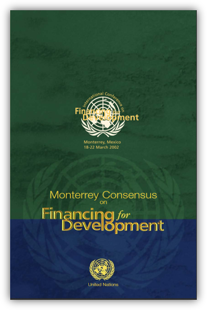
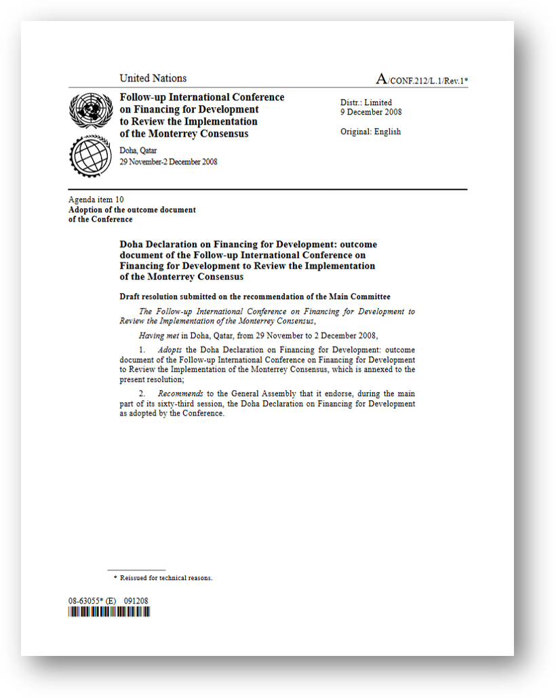
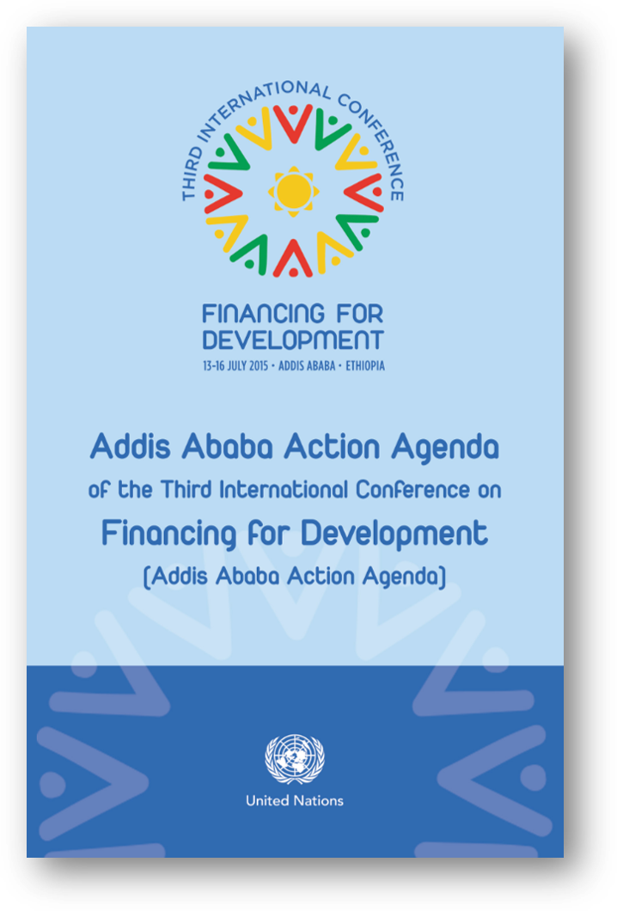
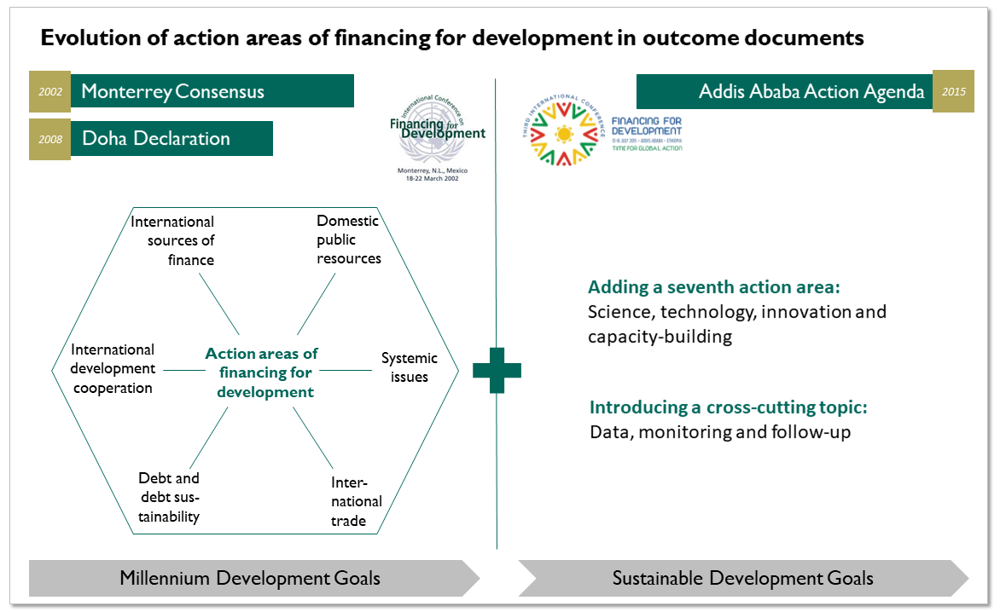

Following the first decade after World War II, representatives from governments established a system of intergovernmental bodies and institutions - such as the United Nations - to sustain peace and foster global development. Initially primarily concerned with the reconstruction of post-war Europe, the focus of initiatives quickly shifted to developing countries in the Southern hemisphere <a href="#ref1">(Eckert 2015)</a>. Governments provided a mix of financial support (financial cooperation) and capacity-building measures (technical cooperation) to partner countries. Despite first efforts in putting developing countries on a sustainable growth path and reducing inequalities, poverty, corruption and health threats persisted.

## The United Nations takes action on financing for development

With the turn of the millennium, 189 countries agreed for the first time in history on a universal agenda and adopted the United Nations Millennium Declaration. Eight measurable Millennium Development Goals (MDGs) defined the framework to eradicate poverty and improve livelihoods of the poorest by 2015. In view of slow progress in the implementation of these goals, fragmented efforts and insufficient measures to track progress, the international community soon recognized the need to step up efforts in financing development cooperation involving actors and instruments beyond traditional state aid.

### 2002: Monterrey Consensus - introducing the financing for development concept

Two years after the adoption of the Millennium Declaration, the United Nations took action. It organized the first conference on financing for development in Monterrey, Mexico, and thereby coined the term 'financing for development'. The conference brought together Member States, international finance institutions, civil society and the private sector to discuss the integration of and coalition with new stakeholders in the global financing architecture for development. They signees stress the following in the <a href="#ref2">Monterrey Consensus</a>:

<blockquote cite="https://www.huxley.net/bnw/four.html">
 
We the heads of State and Government, gathered in Monterrey, Mexico, on 21 and 22 March 2002, have resolved to address the challenges of financing for development around the world, particularly in developing countries. Our goal is to eradicate poverty, achieve sustained economic growth and promote sustainable development as we advance to a fully inclusive and equitable global economic system.

</blockquote>

The outcome document identifies six action areas along the domestic/international and public/private axes: (i) domestic public resources; (ii) domestic and international private business and finance; (iii) international development cooperation; (iv) international trade as an engine for development; (v) debt and debt sustainability; and (vi) addressing systemic issues (Figure 1). Partner countries commit themselves to increasing their Official Development Assistance (ODA) to 0.7 per cent of Gross National Income, cutting debt of heavily indebted poor countries and increasing foreign direct investment. At the same time, developing countries strive to mobilize more domestic resources, fight capital flight and gain broader access to global markets. The document recognizes the importance of South-South cooperation to share best practices. To build a fairer architecture of global financing, the need for strengthened country ownership and a stronger voice of developing countries is emphasized. Yet, it is interesting to note that the document classifies strictly differentiates between 'donor' and 'recipient' countries, referring to a North-South divide between developed and developing countries.

### 2008: Doha Declaration - call for continued and coordinated action

Half into the implementation of the MDGs, the task of the second conference on financing for development in Doha, Qatar, was to take stock of progress achieved and to identify new challenges. While the <a href="#ref3">Doha Declaration</a> recognizes progress in the six key areas defined in the Monterrey Consensus, new challenges threatened the successful implementation of the MDGs. The first decade of the 2000s brought increased food insecurity, volatile energy and commodity markets, risks associated with climate change and the global financial crisis as well as the emergence of new actors and instruments. In view of those developments, the Doha Declaration emphasizes - building upon the Monterrey Consensus - that success is only possible if national development efforts are accompanied by an enabling international economic environment with more concrete, specific and effective commitments. I would like to highlight five advancements of the declaration:

* In view of the challenges for the international community as a whole, strong emphasis is placed on the 'global partnership for sustainable development' and the effective participation of developing countries in international governance structures.
* It is recognized that emerging economies increasingly act as providers and recipients of development cooperation. Yet, South-South cooperation is to be seen as a complement and not as a substitute to North-South cooperation.
* Advancements in policy reforms in developing countries have been made, but paying lip service is not enough. Stronger links of policies to the most vulnerable, an enabling environment to attract private finance and a complete tax system reform are needed.
* Innovative financing mechanisms need to be scaled up to generate revenues. As the importance of migration flows and of remittances as private sources of finance increase, costs of sending remittances need to be lowered significantly.
* Inequalities between countries need to be further reduced. Partner countries are requested to increase their efforts in providing financial and technical cooperation to countries most in need, including a countries emerging from conflict.

### 2015: Addis Ababa Action Agenda - a global partnership for sustainable development

After the expiry of the MDGs, and committed to drive change even further, 193 Member States signed in 2015 the 2030 Agenda for Sustainable Development with its 17 Sustainable Development Goals (SDGs). This universal agenda builds upon two UN processes: the Millennium Declaration on development from 2000 and the Earth Summit on climate change in 1992. To discuss the financing needs of this ambitious agenda, governments signed in Ethiopia the <a href="#ref4">Addis Ababa Action Agenda</a> (AAAA) - a global financing framework that stresses the need to incorporate sustainability concerns in all policies and financial flows.

While the MDGs focused on progress for a subset of countries only, the SDGs urge immediate action by the whole international community to ensure that our world gets back on sustainable path. By emphasizing the revitalized global partnership for sustainable development and a common responsibility, it moves away from the previous North-South-divide and acknowledges the stronger voice of Southern actors. In view of conflicting interests of developing and developed countries, commitments in the global financing framework however remain vague.

<table class="image" align="right">
<tr><td></td></tr>
<tr><td class="caption" align="center" >Figure 1</td></tr>
</table>
 
 

Further advancements in the global financing framework become apparent when comparing key action areas of the Monterrey Consensus and the AAAA (Figure 1). The AAAA reaffirms former commitments made in the six topics specified in Monterrey and Doha, while adding 'science, technology, innovation (STI) and capacity-building' as a seventh key area to emphasize the importance of this category as an enabler of growth. To bridge the digital divide within and between countries, capacity building, technology development and transfer as well as policy change are crucial. The AAAA places strong emphasis on the cross-cutting issue of data, monitoring and follow-up. As adequate policy-making hinges upon high-quality disaggregated information, national capacities to create, manage and analyze data need to be strengthened. Alternative measurements beyond per capita income should be developed to track progress on sustainable development.

## Financing for development to coordinate global action

Put in a nutshell, financing for development is a term that has been established only 17 years ago. Yet, it evolved significantly to incorporate increased concerns about sustainability and risks associated with climate change. Financing for development encompasses all financing flows - domestic and international, private and public - that aim at driving change and development. To align these flows as well as policies and international agreements with economic, social and environmental priorities, global financing frameworks such as the Monterrey Consensus and AAAA have been established. These frameworks provide policy guidance to coordinate actions by governments, international organizations, the business sector, civil society, and philanthropists. Despite the persisting SDG financing gap, the international community has not taken any action on its consideration in the AAAA to hold a follow-up conference by 2019. The term financing for development might nevertheless be adapted to the realities of international development cooperation in the next decade, even if the bottom line - national/international as well as public/private sources of finance are needed - will remain the same.

### Sources

Eckert, Andreas (2015). <i>Geschichte der Entwicklungszusammenarbeit</i>, in: Aus Politik und Zeitgeschichte 7-9/2015, pp. 3-8.

United Nations (2002). <i>Report of the International Conference on Financing for Development</i>, Monterrey, Mexico, 18-22 March 2002 (A/CONF.198/11, chapter 1, res. 1, annex).

United Nations (2008). <i>Report of the Follow-up International Conference on Financing for Development</i>, Doha, Qatar, 29 November-2 December 2008 (A/CONF.212/L.1/Rev.1*).

United Nations (2015). <i>Report of the third International Conference on Financing for Development</i>, Addis Ababa, Ethiopia, 13-16 July 2015 (A/CONF.227/20, chapter 1, res. 1, annex).

