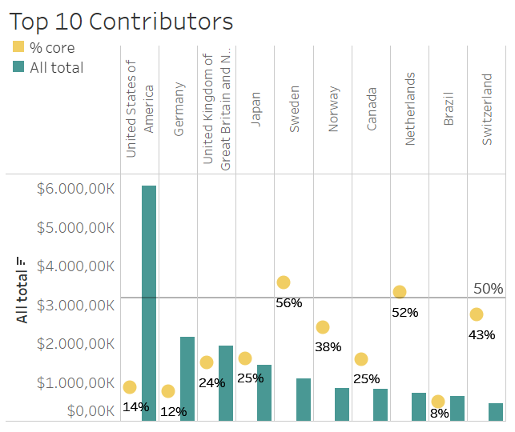

The buzz term 'blockchain' is on everyone's lips - from technology enthusiasts over business people to international development experts - and transformative application cases are hotly debated. In an attempt to find facts among dreams and fears and separate the hype from the substance, I initiated and co-organized the CSP-Salon in 2018 in New York that provided a platform to debate the revolutionary potential of blockchain for the SDGs.

## Blockchain has far-reaching potential to help achieve the SDGs

Amidst all the hype and activity surrounding blockchain, one cannot help but wonder whether blockchain can indeed be seen as a panacea for sustainable development and enable inclusive transformations, benefitting the most vulnerable. Based on the inputs of a distinguished panel with speakers from the United Nations, the private sector, academia and civil society, a spectrum of key benefits as well as challenges of blockchain technology has been highlighted.

<!-- -->

<ul style="list-style-type:square;">
    <li>
<b>SDG 16 - Peace, Justice and Strong Institutions:</b> Accessing services like healthcare, voting and education comes in lockstep with legal proof of identification – if you don’t have it you can’t participate. Considering that the birth of one out of four children remains unregistered, a blockchain-based identity system could allow people to handle governance services through uniquely assigned IDs. By making information resilient to corruption, blockchain could also help to transparently map the development cooperation supply chain and effectively target the furthest behind. The implementation of such IDs however might face barriers in regions with low levels of literacy, cell phone penetration and broadband connectivity. Open transparency might also not be welcome in all cases, as experiences from the field imply.
</li>

    <li>
<b>SDG 8 - Decent Work and Economic Growth:</b> Two billion people nowadays still do not own a bank account – most of them women. Blockchain , as the back-bone of cryptocurrencies, can provide unbanked people with access financial services and overcome the limitations of the traditional banking system.  The participation of previously unbanked people in the global economy could reduce income as well as gender inequality, create new jobs and foster economic growth at large. It is estimated that the more inclusive digital finance system will generate $3.7 trillion and an increase of 6% in global GDP by 2025. Nonetheless, it has to be pointed out that jobs currently performed by humans could potentially be destroyed.
</li>

    <li>
<b>SDG 10 - Reduced Inequalities:</b> According to Oxfam, 82% of all wealth created in 2017 went to the top 1% of the global population thus contributing to the deeply concerning trend of inequality worldwide. Thanks to its decentralized nature and based on the concept of a sharing economy, blockchain enables a more equal distribution of wealth prior to its creation. By transferring assets peer-to-peer instead of going through centralized companies like Airbnb, every citizen can become a co-owner of a sharing platform. The reliance on such blockchain use cases will however be limited by market logics: for mass adoption, they must become economically more attractive than their centralized alternatives.
</li>

    <li>
<b>SDG 1 - No Poverty:</b> In 2016, global remittance flows to developing countries have been registered at $429 billion, with the cost of sending money across borders continuing to be exorbitantly high. Remaining well above the targeted 3% envisaged by the 2030 Agenda, the average cost of sending $200 stagnated at $7.45 in 2017. By removing the need for a trusted middleman, blockchain is able to reduce fees and transfer remittances more quickly. This facilitates the process of sending money, which still makes up a large part of GDP in developing countries. Besides easing the burden of migration and alleviating poverty, the reliance on blockchain could therefore also reinforce economic development.
</li>

    <li>
<b>SDG 7 - Affordable and Clean Enegery:</b> The technology could also influence energy trading by circumventing centralized markets and giving consumers the possibility to engage in peer-to-peer virtual energy networks using local sources. This would not only decrease costs, but also allow buyers to favor renewables. One has however also to address the massive energy consumption of crypto-currencies. Estimates show that Bitcoin alone uses more energy than Iceland, causing excessive negative externalities on the global ecosystem. Now that governments too are creating their own cryptocurrencies, new ways to limit their massive electricity consumption are urgently needed.
</li>
</ul>

<!-- such as birth registrations, elections and healthcare
blockchain offers the hitherto unprecedented possibility of providing citizens with a digital ID.
Transparent, effective and swift delivery is crucial in aid and development financing. By
-->

<!--Plus, state interests and regulatory constraints might also become hurdles on the way towards a true sharing economy.
As heavy centralization drives our global economy, a pyramid is created where the powerful and rich feed off the masses. So what role does blockchain play?-->

<!-- But solutions are already on the way: To make transaction verification processes of cryptocurrencies more sustainable, the tech community is, inter alia, increasingly shifting from Proof of Work mining to Proof of Stake forging. Moreover, companies are increasingly relying on renewable energy sources for mining -->

Beyond these use cases, blockchain can benefit many other SDGs. For instance, smart contracts can automate greenhouse gas certificate transactions, enforcing climate change accountability at a low-cost level. Furthermore, blockchain can provide an open, decentralized voting record to citizens, giving them the option to verify whether voter fraud has occurred. In addition, the technology’s characteristic of recording
property transactions can also be harnessed to ensure more effective property management.

## Blockchain development is still in its Wild West phase

At the moment, the technology still hovers somewhat uneasily between forecasts emphasizing its huge potential and real application cases where the technology’s added value materializes. Contrary to the internet, which relies on sophisticated governance models, blockchain is thus still very much in its Wild West phase. A much-debated issue is the lack of accountability blockchain use cases bring along. As a counterreaction to centralized power structures, blockchain was designed to be inherently resistant to modification of data being decentralized by nature. No legal recourse systems or watchdogs overseeing the blockchain ecosystem and its economic, ecological or social consequences are available. Proper legal and accountability frameworks leaving room for human beings will thus have to be developed, keeping in mind that although slow, centrally controlled and fee-based trusted middlemen might still offer undeniable advantages.

<!--In light of the above, it is not surprising that the hype surrounding blockchain is not ebbing away. Start-ups are shooting up like mushrooms, new cryptocurrencies are created every week and investors are spoilt for choice with blockchain initiatives to buy into. Yet, amidst all this activity, one cannot help but wonder whether blockchain can indeed be seen as a panacea for sustainable development.

To ensure that blockchain can follow up on the potential it outlines, several showstoppers have to be addressed.

Many governance challenges remain unsettled and pitfalls loom around the corner. Sound and inclusive governance models will be critical.-->

<!-- Besides this, governance debates also center on a wide range of other issues. For example, major concerns include how our current financial and political systems will adapt to the new ways of interaction offered by blockchain. What barriers to cultural adoption exist? And on a very technical level, will our search for solutions in terms of scalability and interoperability be successful?-->

## Multi-stakeholder dialogue is crucial to join forces

To make blockchain work for the 2030 Agenda, the tech world, the private sector and the international development community thus have to find ways to leapfrog their core differences. On the one hand, development experts have to jump over their own shadow and embrace new approaches to their work. On the other hand, technology enthusiasts and social entrepreneurs ready to go beyond private-sector applications have to adequately address negative impacts and unintended consequences of their products. It will be imperative to understand blockchain’s capacities and to center use cases around recipient’s vulnerabilities and needs. For the development of such human-needs focused blockchain applications, multi-stakeholder cooperation will be vital. The capacity of all involved actors to understand each other and move into the same direction will be the judge of whether blockchain can deliver on the promises it holds for a more sustainable world.

### Sources

<!--<a href="#ref4">Addis Ababa Action Agenda</a>

XXX
-->

This post is based on a conference paper published at Stiftung Mercator: Eggler, S., Lehmann, A., Witkowski, C. (2018). <a href="https://www.stiftung-mercator.de/de/publikation/blockchain-new-avenues-for-the-sdgs/" target="\_blank"><u>Blockchain. New Avenues for the SDGS?</u></a>. January 19, 2018.

<a href="https://www.mckinsey.com/~/media/mckinsey/featured%20insights/Employment%20and%20Growth/How%20digital%20finance%20could%20boost%20growth%20in%20emerging%20economies/MGI-Digital-Finance-For-All-Executive-summary-September-2016.ashx" target="\_blank"><u>Digital Finance for All. 2016. McKinsey&Company.</u></a>

<a href="http://pubdocs.worldbank.org/en/992371492706371662/MigrationandDevelopmentBrief27.pdf" target="\_blank"><u>Migration and Remittances. 2017. World Bank Group.</u></a>

<a href="https://www.washingtonpost.com/news/worldviews/wp/2018/02/13/cryptocurrency-mining-in-iceland-is-using-so-much-energy-the-electricity-may-run-out/?noredirect=on&utm_term=.205a53ca668c" target="\_blank"><u>Cryptocurrency mining in Iceland. 2018. The Washington Post.</u></a>

<a href="https://d1tn3vj7xz9fdh.cloudfront.net/s3fs-public/file_attachments/bp-reward-work-not-wealth-220118-en.pdf" target="\_blank"><u>Reward work, not wealth. 2018. Oxfam.</u></a>

<a href="https://data.unicef.org/topic/child-protection/birth-registration/" target="\_blank"><u>Child protection. 2018. UNICEF</u></a>

<!-- 

<b>Observation 2:</b> 
 -->
