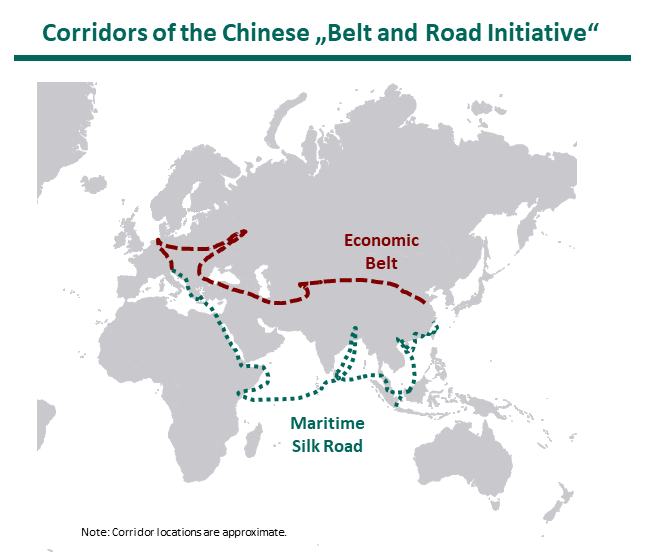

The Chinese President Xi Jinping has been touring Europe to discuss closer bilateral cooperation with selected states. This included a three-day-trip to Italy to sign a Memorandum of Understanding on Italy’s participation in the Belt and Road Initiative. As the first country among the G7 to join this Chinese-backed policy, and quickly followed by Luxembourg, this immediately provoked heated discussions. Why are Italy and Luxembourg so eager to join, and why are fellow European countries more hesitant in becoming part of this ambitious infrastructure project?

## What is the Belt and Road Initiative?

As a response to slow global growth and to enhance regional connectivity, Jinping introduced in 2013 the Belt and Road Initiative (BRI)  that reestablishes centuries-old trade routes. The Silk Road Economic Belt connects Central Asia and Europe through overland routes, while the Century Maritime Silk Road represents a network of shipping lanes extending to East Africa. But the BRI is more than mere infrastructure investments in railways, ports and highways: as an ambitious multilateral project, it aims at increasing cooperation in fields such as technology and facilitating trade.

The scale and lack of transparency of the BRI make it difficult to get up-to-date information on its impact: It is estimated that around two-thirds of the population and one-third of the GDP worldwide are affected. According to the Guardian, the BRI is expected to cost more than $1tn, with $210bn already invested for more than 600 projects. Any country is welcome to become part of the BRI, yet the total number of countries having joined the BRI remains unknown. By the end of September of 2018, China had signed agreements with 74 countries and international organizations. Since then, at least Italy and Luxembourg have been added to this list.

## Regional connector vs. economic exploiter

With its geopolitical and economic motivation for the implementation of the BRI, the Chinese government is killing two birds with one stone. The BRI enables China to sell its products faster, at lower costs, and to a bigger customer base. At the same time, the government can prominently present itself as a firm development cooperation partner assuming responsibility for the implementation of the 2030 Agenda for Sustainable Development. Positioning itself as a good guy among Southern nations, the Chinese government repeatedly confirmed its commitment to SSC principles such as national sovereignty, non-interference in domestic affairs and mutual benefits. If implemented according these principles, the BRI can undoubtedly unfold a massive economic impact through enhanced regional connectivity, new jobs and subsequent economic growth. Yet, pitfalls loom large. The Center for Global Development for instance identified eight countries in Africa and Asia that are at risk of not being able to repay their debt to China. The Center for Global Development found that China for instance signed off debt in exchange for Tajikistan land or 99-year lease of a port in Sri Lanka. Due to a lack of transparency, it further remains unclear whether the ecological and social dimension (e.g. human rights obligations) are adhered to in the implementation of the projects, and who exactly is filling one's pockets. The lack of transparency might have been one of the main reasons why countries of the Western hemisphere have been hesitant to join the BRI until now.

<!--This month, Vice-Premier Hu Chunhua for instance attended the  and reiterated that China would continue to stick to the rules of the game? But Northern European countries are more hesitant, rules of obligation,-->

## Win-win for participating members

Official Chinese-EU relations started in 1975 and the current joint strategic agenda, serving as a policy guidance for the multilateral cooperation, has been adopted in 2013. Yet, the basis for economic collaboration traditionally formed bilateral agreements. With Italy and Luxembourg going one step further and joining the BRI on top of signing bilateral agreements, this provoked mixed reactions. Some countries fear a Trojan horse, while others anticipate losses due to re-directed trade routes through Italian ports. It is obvious that China looks for easier access to European customers - Europe is China's biggest trading partner - but what are Italy and Luxembourg actually taking home from the deal? First, China can help paying for much-needed modernized infrastructure, even in indebted countries. Second, these countries can themselves export their goods (e.g. Italian luxury goods) to the Asian giant. Finally, joining the BRI might enable European states to collaborate in the massive investments that China is undertaking in Africa. Will these arguments be enough for the rest of the European countries to follow suit and ignore the lack of transparency?

## Will the EU overcome its Sino-skepticism?

At bilateral meetings with Jinping this week, the President of France Emmanuel Macron at least attested the end of "the period of European naïveté". Future summits, such as the annual EU-China summit on 9 April in Brussels or the second Belt and Road Forum later that month in Beijing, provide good opportunities to work towards increased reciprocity and transparency in cooperation. China is certainly showing its willingness to uphold multilateralism, especially in view of increasing protectionism. While Jinping sees potential in aligning the BRI with the EU vision of an Euro-Asian connectivity strategy and strengthening its role in multilateral discussions, the EU might focus on foreign and security policy issues with an emphasis on strengthened cooperation in Africa. It will be up to the European leaders to decide whether they are ready for a unified response towards Chinese policy, or whether Italy and Luxembourg remain on their own in joining the BRI.

<!--The ambitious Chinese infrastructure plans are globally known and sometimes referred to as an imperialist approach.
After having visited Italy and with strong commitment to strengthen their China-European Union (EU) relations, -->

### Sources

Belt and Road Portal. <a href="https://eng.yidaiyilu.gov.cn/dsjym.htm" target="\_blank"><u>News section.</u></a>

Center for Global Development. <a href="https://www.cgdev.org/publication/examining-debt-implications-belt-and-road-initiative-a-policy-perspective" target="\_blank"><u>Examining the Debt Implications of the Belt and Road Initiative from a Policy Perspective.</u></a> 4 March 2019.

European Council. <a href="https://www.consilium.europa.eu/en/meetings/calendar/?filters=2034" target="\_blank"><u>Meeting Calendar.</u></a>

European Union External Action. <a href="https://cdn1-eeas.fpfis.tech.ec.europa.eu/cdn/farfuture/rVotT71TqcUuInsE7VOb7j1_xi9jIMcvhhHxcYLGE1g/mtime:1552379624/sites/eeas/files/factsheet_eu-china_03_2019.pdf" target="\_blank"><u>EU-China relations factsheet.</u></a>

European Union External Action. <a href="https://eeas.europa.eu/sites/eeas/files/europe_asia_connectivity_factsheet_1.pdf" target="\_blank"><u>Connecting Europe & Asia: The EU Strategy.</u></a>

The Guardian. <a href="https://www.theguardian.com/cities/ng-interactive/2018/jul/30/what-china-belt-road-initiative-silk-road-explainer" target="\_blank"><u>What is China's Belt and Road Initiative?</u></a> 30 July 2018.

The New York Times. <a href="https://www.nytimes.com/2019/03/23/world/europe/italy-china-xi-silk-road.html?module=inliner" target="\_blank"><u>Defying Allies, Italy signs on to New Silk Road With China.</u></a> 23 March 2019.

