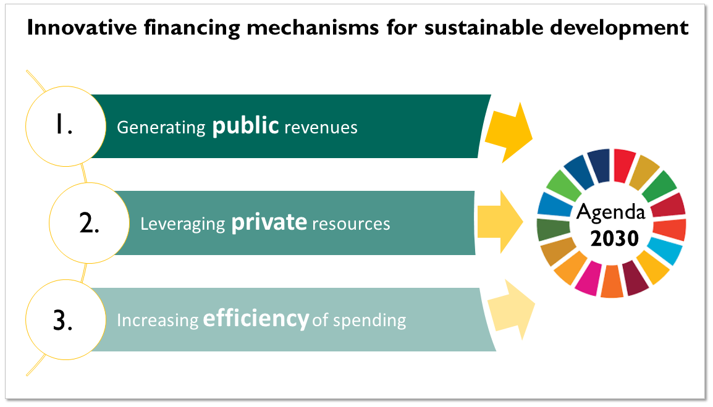

A very famous <a href="https://unctad.org/en/PublicationsLibrary/wir2014_en.pdf" target="\_blank"><u>UNCTAD report</u></a> from 2014 states that only slightly more than one third of money needed to finance the implementation of the SDGs  is currently mobilized each year, leaving an annual gap of USD 2.5 trillion. Thus, non-traditional mechanisms to raise additional funds for sustainable development cooperation yet complementary to Official Development Assistance (ODA) have to be used. To mobilize more money, one can source more money - using existing channels and identifying new partners - or spend money more efficiently. Three overlapping approaches have been identified by the international development community in the MDG era (see also a <a href="https://www.kfw-entwicklungsbank.de/Download-Center/PDF-Dokumente-Development-Research/2012-08-14_FE_IFD_EN.pdf" target="\_blank"><u>paper</u></a> by H. Wäldle, KfW, for an excellent overview), which can be also transferred to the 2030 Agenda for Sustainable Development.

<ol>
<li>
<b>New sources of government revenues leave room to spend extra income on fostering sustainable development and development cooperation.</b> Additional income at the public level can be generated by for instance auctioning off emission permits. These mechanisms can be implemented in countries providing ODA, or utilized in emerging economies to invest into the development of national structures.
</li>

<!-- focus on environmental dimensions. They -->

<li>
<b>Innovative mechanisms can leverage private resources to capital-intensive projects in risky environments with high returns.</b> Commercial investors often shy away from risky investments (e.g. corruption, untrained workforce), even if these might yield high returns. This is where governments and philanthropic organizations step in: to crowd in more money, they often guarantee a lower risk exposure or offer more favorable terms. Since the introduction of the SDGs, the term <i>blended finance</i> is increasingly used to describe the pooling of public and private money.
</li>

<li>
<b>Increasing the efficiency of current ways of spending can free up different funds for sustainable development.</b> Technological advancements enable a more efficient monitoring and evaluation of projects on the ground as well as improved coordination structures going beyond traditional bilateral partnerships. Thus, initiatives conditioning financing on outcomes shoot up like mushrooms and the private sector has begun to pay attention to environmental, social and governance (ESG) factors that respect the three-dimensional approach of the 2030 Agenda. At the individual level, person-to-person giving could positively contribute to sustainable development as it is estimated that 75% of individual investors are nowadays interested in how their money is spent.
</li>
</ol>

One concrete example of an innovative mechanism is the International Financing Facility for Immunization (IFFIm), where money on the private market is mobilized - backed up by government-issued bonds - to finance immunization programmes worldwide. These contracts give pharmaceutical companies the guarantee that the successfully developed vaccines will be bought, yielding high returns. Even though the <a href="https://www.un.org/esa/ffd/wp-content/uploads/2015/08/AAAA_Outcome.pdf" target="\_blank"><u>Addis Abeba Action Agenda</u></a> (AAAA) encourages "consideration of how existing mechanisms, such as the [IFFIm], might be replicated", there haven't been too many innovative facilities introduced, especially ones that consider under-funded social sectors. Instead, emphasis seems to be put on infrastructure projects based on public-private-partnerships which are repeatedly reported to cause massive debt dependencies (a more in-depth discussion of blended finance will be published in a separate post).

## From the MDGs to the SDGs: lost momentum in innovative financing?

Following the MDGs and the ambitious aid effectiveness agenda of the beginning of the 21st century, is there still momentum to find new financing mechanisms for sustainable development? The <a href="http://www.leadinggroup.org/rubrique20.html" target="\_blank"><u>Leading Group on Innovative Financing for Development</u></a>, created in 2006 and consisting of 66 representatives from governments and the private sector, seems to have lost its drive since the adoption of the 2030 Agenda. Annual presidencies are irregular, and focus has shifted to impact investment and blockchain projects - potentially away from initiatives targeting those furthest behind.

The <a href="https://developmentfinance.un.org/fsdr2019" target="\_blank"><u>2019 Financing for Sustainable Development Report</u></a>, published in its third version only days ago, aims at tracking progress on the implementation of the AAAA. Although rich in the description of international financing flows for sustainable development, <a href="https://www.odi.org/comment/10745-new-pan-agency-development-financing-report-suggests-major-economic-crisis-brewing" target="\_blank"><u>Jesse Griffiths</u></a> (Head of the development finance programme at ODI) criticizes the report for being too light on solutions. But the first take should be, especially in times of a multilateral crisis, to re-commit ourselves to action across borders and sectors. It is crucial to bring different actors to one table and to discuss already existing pilots that need to be scaled up through money re-channeled from the private sector, targeting those furthest behind first.

<!--
In the SDG era, especially blended finance has attracted much attention, and policy-makers increasingly recognize the importance of peer-to-peer contributions at an individual level (private voluntary financing 75%)

### Sources

Wälde, H. <a href="https://www.kfw-entwicklungsbank.de/Download-Center/PDF-Dokumente-Development-Research/2012-08-14_FE_IFD_EN.pdf" target="\_blank"><u>An Overview of Innovative  Financial Instruments Used to Raise Funds for International Development.</u></a> KFW Development Research. 14 August 2012.

We need to re-commit ourselves to multilateral action, and scale up current
responded quite clearly: there are many good pilots, but they need to be scaled for significant impact. At the end of the day and in times of a strained multilateral system, we need to re-commit ourselves to action and think of mechanisms to reach of those furthest behind, beyond blended finance. focus on structures and mechanisms to reach those furthest behind

global platform made up of 55 member countries with differing levels of development, operating alongside international organisations and NGOs. Formerly known as the Leading Group on Solidarity Levies to Fund Development, the Leading Group seeks to promote the implementation and definition of innovative financing mechanisms around the world.

It is important to note that these mechanisms can also overlap. Impact funds for instance combine elements of blended finance and impact investment.
This therefore creates even more confusion. “Innovative financing for development DOES NOT complicates aid architecture.” Countries involved in innovative financing give more importance to abiding by the principles of aid effectiveness and coherence.

Innovative financing mechanisms involve cooperation beyond bilateral government structures, increasingly attracting actors from the private sector and civil society. In the following, three overlapping approaches to finance sustainable development will be explained in more detail.

These approaches, and a fantastic overview from the KfW from 2013, connivingly demonstrate that there are indeed many smart ideas to mobilize money beyond ODA. But what are concrete examples for innovative financing mechanisms?

-->
